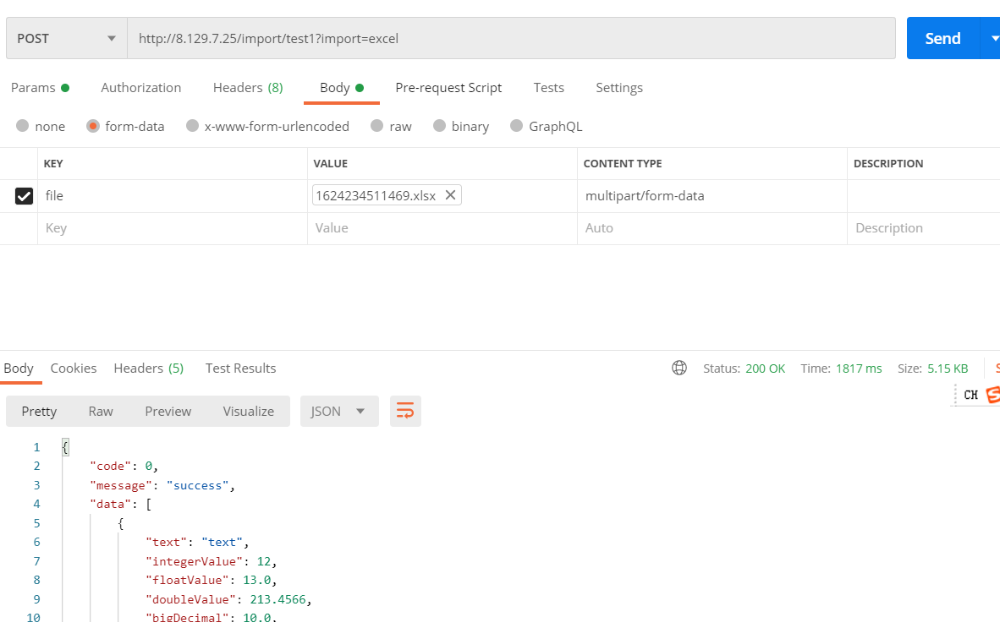

# EasyExcelPlus

<p align="center">
  为简化开发工作、提高生产率而生
</p>

<p align="center">
  <a href="https://search.maven.org/search?q=g:io.github.gongbox%20AND%20a:easyexcel-plus*">
    
  </a>

  <a href="https://www.apache.org/licenses/LICENSE-2.0">
    
  </a>
</p>

# 简介

EasyExcel 增强工具包 - 只做增强不做改变，简化导入，导出操作

技术讨论 QQ 群 ： 779290098

# 优点 | Advantages

- **无侵入**：EasyExcelPlus 在 EasyExcel 基础上开发，只做增强，不做改变，引入 EasyExcelPlus 不会对您现有的 EasyExcel 构架产生任何影响，而且 EasyExcelPlus 支持所有 EasyExcel 原生的特性
- **易使用**：通过注解的方式配置导出，配置简单，快速开发导出功能
- **更简洁**：导出与查询合二为一，减少重复代码
- **损耗小**：EasyExcelPlus 对使用性能几乎没有影响


# Latest Version: [](https://search.maven.org/search?q=g:io.github.gongbox%20a:easyexcel-plus*)

``` xml
<dependency>
    <groupId>io.github.gongbox</groupId>
    <artifactId>easyexcel-plus-boot-starter</artifactId>
    <version>Latest Version</version>
</dependency>
```
## 使用示例：
下面是一个普通查询接口：
```java
@GetMapping(value = "test1")
public Result<List<ExportDemoView>> test1() {
    return Result.success(ExportDemoView.data());
}
```
返回数据如下：
> 演示地址：http://8.129.7.25/test1

若要实现导出excel，只需要在接口上增加注解@EnableExport即可，如下所示：
```java
@GetMapping(value = "test1")
@EnableExport
public Result<List<ExportDemoView>> test1() {
    return Result.success(ExportDemoView.data());
}
```
添加该注解后，接口依然正常查询，导出时只需要添加请求参数export=excel即可，如下所示：
> 演示地址：http://8.129.7.25/test1?export=excel

## 更多示例
EasyExcelPlus支持多种多样的自定义配置，比如设置导出文件名、文件格式，模版导出，导出数据转换等等。

### 环境说明
- 模型类：
  ```java
  @Data
  public class ExportDemoView {
      @ExcelProperty
      private String text = "text";
      @ExcelProperty
      private Integer integerValue = 12;
      @ExcelProperty
      private Float floatValue = 13.0f;
      @ExcelProperty
      private Double doubleValue = 213.4566;
      @ExcelProperty
      private BigDecimal bigDecimal = BigDecimal.TEN;
      @ExcelProperty
      private LocalDate localDate = LocalDate.now();
      @ExcelProperty
      private LocalDateTime localDateTime = LocalDateTime.now();
      @ExcelProperty
      private Date date = new Date();
  
      public static List<ExportDemoView> data() {
          return Stream.generate(ExportDemoView::new)
                  .limit(new Random().nextInt(10))
                  .collect(Collectors.toList());
      }
  }
  ```
- 配置文件:
  ```yaml
  server:
    port: 80
  excel-plus:
    export:
      responseClassName: com.gongbo.excel.example.result.Result
  ```
### 使用

- **导出-设置导出文件名称**
    ```java
    @GetMapping(value = "test2")
    @EnableExport(fileName = "文件名称")
    public Result<List<ExportDemoView>> test2() {
        return Result.success(ExportDemoView.data());
    }
    ```
  >演示地址：http://8.129.7.25/test2?export=excel
- **导出-动态设置文件名称**
    ```java
    @GetMapping(value = "test3")
    @EnableExport(fileNameConvert = CustomFileNameConvert.class)
    public Result<List<ExportDemoView>> test3() {
        return Result.success(ExportDemoView.data());
    }
    public static class CustomFileNameConvert implements FileNameConvert {
        @Override
        public String apply(String fileName) {
            return LocalDate.now().format(DateTimeFormatter.BASIC_ISO_DATE);
        }
    }
    ```
  >演示地址：http://8.129.7.25/test3?export=excel
  
  或者
    ```java
    @GetMapping(value = "test4")
    @EnableExport
    public Result<List<ExportDemoView>> test4() {
        if (ExportContextHolder.isExportExcel()) {
            ExportContextHolder.getContext().setFileName("动态文件名称");
        }
        return Result.success(ExportDemoView.data());
    }
    ```
  >演示地址：http://8.129.7.25/test4?export=excel
- **导出-固定Sheet名称**
    ```java
    @GetMapping(value = "test5")
    @EnableExport(sheetName = "Sheet0")
    public Result<List<ExportDemoView>> test5() {
        return Result.success(ExportDemoView.data());
    }
    ```
  >演示地址：http://8.129.7.25/test5?export=excel
- **导出-动态设置Sheet名称**
    ```java
    @GetMapping(value = "test6")
    @EnableExport
    public Result<List<ExportDemoView>> test6() {
        if (ExportContextHolder.isExportExcel()) {
             ExportContextHolder.getContext().setSheetName("业务中修改Sheet名称");
        }
        return Result.success(ExportDemoView.data());
    }
    ```
   >演示地址：http://8.129.7.25/test6?export=excel
- **导出到固定文件夹**
    ```java
    @GetMapping(value = "test7")
    @EnableExport(outputPath = "D:\\WorkDir\\temp\\file")
    public Result<List<ExportDemoView>> test7() {
        return Result.success(ExportDemoView.data());
    }
    ```
  >演示地址：http://8.129.7.25/test7?export=excel
- **导出-字段过滤**
    ```java
    @GetMapping(value = "test8")
    @EnableExport(fieldFilter = CustomFieldFilter.class)
    public Result<List<ExportDemoView>> test8() {
        return Result.success(ExportDemoView.data());
    }
    public static class CustomFieldFilter implements FieldFilter {
        @Override
        public boolean predict(Field field) {
            return RandomUtil.randomBoolean();
        }
    }
    ```
  >演示地址：http://8.129.7.25/test8?export=excel
- **导出-设置导出文件格式**
    ```java
    @GetMapping(value = "test9")
    @EnableExport(excelType = ExcelType.XLS)
    public Result<List<ExportDemoView>> test9() {
        return Result.success(ExportDemoView.data());
    }
    ```
  >演示地址：http://8.129.7.25/test9?export=excel
- **导出-数据转换**
    ```java
    @GetMapping(value = "test10")
    @EnableExport(dataConvert = CustomExportDataConvert.class)
    public Result<List<ExportDemoView>> test10() {
        return Result.success(ExportDemoView.data());
    }
    public static class CustomExportDataConvert implements ExportDataConvert {
        @Override
        public List<?> convert(ExportContext exportContext, Object data) {
            Result<?> responseEntity = (Result<?>) data;
            List<ExportDemoView> list = (List<ExportDemoView>) responseEntity.getData();
            for (int i = 0; i < 20; i++) {
                list.add(new ExportDemoView());
            }
            return list;
        }
    }
    ```
  >演示地址：http://8.129.7.25/test10?export=excel
- **导出-同一接口多种导出方式**
    ```java
    @GetMapping(value = "test11")
    @EnableExport(tag = "xls", excelType = ExcelType.XLS)
    @EnableExport(tag = "xlsx", excelType = ExcelType.XLSX)
    public Result<List<ExportDemoView>> test11() {
        return Result.success(ExportDemoView.data());
    }
  ```
  同一接口可以添加多个注解，以实现支持多种导出，通过注解tag属性设置标签，导出时，需要增使用参数export_tag指定标签。
  > 演示地址，导出XLS：http://8.129.7.25/test11?export=excel&export_tag=xls
  
  > 演示地址，导出XLSX：http://8.129.7.25/test11?export=excel&export_tag=xlsx
- **导出-模版导出（单个Sheet）**
    ```java
    @GetMapping(value = "testTemplate1")
    @EnableExport(template = "template1.xls", dataConvert = Template1DataConvert.class)
    public Result<List<ExportDemoView>> testTemplate1() {
        return Result.success(ExportDemoView.data());
    }
    public static class Template1DataConvert implements ExportDataConvert {
        @Override
        public List<?> convert(ExportContext exportContext, Object data) {
            Result<?> responseEntity = (Result<?>) data;

            ExportFillData exportFillData1 = ExportFillData.builder()
                    .data(responseEntity.getData())
                    .build();

            Map<String, String> map = new HashMap<>();

            map.put("name", "名称");
            map.put("date_start", LocalDate.now().format(DateTimeFormatter.BASIC_ISO_DATE));
            map.put("date_end", LocalDate.now().format(DateTimeFormatter.BASIC_ISO_DATE));
            ExportFillData exportFillData2 = ExportFillData.builder()
                    .data(map)
                    .build();

            return Lists.newArrayList(exportFillData1, exportFillData2);
        }
    }
    ```
  >演示地址：http://8.129.7.25/testTemplate1?export=excel
- **导出-模版导出（多个Sheet）**
    ```java
    @GetMapping(value = "testTemplate2")
    @EnableExport(template = "template2.xls", dataConvert = Template2DataConvert.class)
    public Result<List<ExportDemoView>> testTemplate2() {
        return Result.success(ExportDemoView.data());
    }
    public static class Template2DataConvert implements ExportDataConvert {
        @Override
        public List<?> convert(ExportContext exportContext, Object data) {
            Result<?> responseEntity = (Result<?>) data;

            ExportFillData exportFillData1 = ExportFillData.builder()
                    .sheetName("Sheet1")
                    .data(responseEntity.getData())
                    .build();

            Map<String, String> map = new HashMap<>();

            map.put("name", "名称");
            map.put("date_start", LocalDate.now().format(DateTimeFormatter.BASIC_ISO_DATE));
            map.put("date_end", LocalDate.now().format(DateTimeFormatter.BASIC_ISO_DATE));
            ExportFillData exportFillData2 = ExportFillData.builder()
                    .sheetNo(0)
                    .data(map)
                    .build();

            return Lists.newArrayList(exportFillData1, exportFillData2);
        }
    }
    ```
   >演示地址：http://8.129.7.25/testTemplate2?export=excel
- **导入-模板下载**
    ```java
    @GetMapping(value = "test5")
    @EnableImport(modelClass = ExportDemoView.class)
    public void test5() {
    }
   ```
  >演示地址：
  > 导入-模版下载：http://8.129.7.25/import/test5?import=template
- **导入-导入**
    ```java
    @PostMapping(value = "test4")
    @EnableImport
    public Result<ExportDemoView[]> test4(@RequestBody(required = false) ExportDemoView[] param) {
        return Result.success(param);
    }
   ```
  
  >演示地址：
  > 导入-模版下载：http://8.129.7.25/import/test4?import=excel
- **导入-模板下载、数据导入**
    ```java
    @RequestMapping(value = "test1", method = {RequestMethod.GET, RequestMethod.POST})
    @EnableImport
    public Result<ExportDemoView[]> test1(@RequestBody(required = false) ExportDemoView[] param) {
        return Result.success(param);
    }
   ```
  
  >演示地址： 导入-模版下载：http://8.129.7.25/import/test1?import=template
    
  >演示地址： 导入-数组参数：http://8.129.7.25/import/test1?import=excel
# 期望 | Futures

> 欢迎提出更好的意见，帮助完善 EasyExcelPlus

# 版权 | License

[Apache License 2.0](https://www.apache.org/licenses/LICENSE-2.0)

# 关注我 | About Me

[简书](https://www.jianshu.com/u/9d2985772d9a)

