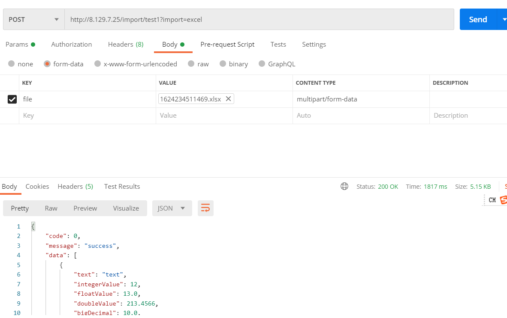

# EasyExcelPlus

<p align="center">为简化开发工作、提高生产率而生</p>

<p align="center">
  <a href="https://search.maven.org/search?q=g:io.github.gongbox%20AND%20a:easyexcel-plus*">
    
  </a>
  <a href="https://www.apache.org/licenses/LICENSE-2.0">
    
  </a>
</p>

## 项目简介

EasyExcelPlus 是一个**导入/导出通用工具包**，用于简化 Web 场景下的 Excel 导入与导出开发：

- **导出**：在原有查询接口上增加 `@Export` 注解，即可让同一接口同时支持“正常查询返回 JSON”和“导出 Excel”（通过请求参数切换）
- **导入**：在原有批量新增接口上增加 `@Import` 注解，即可支持“模板下载”和“Excel 导入”

> 注意：本项目与阿里 `easyexcel` 不是同一个作者；`easyexcel` 作者的最新项目为 `fastexcel`。

## 社区交流

- **技术讨论 QQ 群**：`779290098`

## 优点（为什么用它）

- **易使用**：只需极少的配置即可接入
- **更简洁**：复用原查询/批量新增接口，无需为导入/导出单独再写一套 Controller
- **更规范**：查询与导出（批量新增与导入）使用同一请求地址，只需记住业务接口地址即可
- **损耗小**：对原接口性能影响极小（仅在触发导入/导出时生效）
- **可扩展**：默认适配阿里 EasyExcel，也可通过 Adapter 接入其他实现

## 目录

- [快速开始](#快速开始)
- [最小示例：给查询接口加导出能力](#最小示例给查询接口加导出能力)
- [功能介绍](#功能介绍)
- [配置说明](#配置说明)
- [模块说明](#模块说明)
- [期望 | Futures](#期望--futures)
- [License](#license)
- [About Me](#about-me)

## 快速开始

### Maven

`easyexcel-plus-boot-starter` 最新版本（Maven Central）：
[](https://search.maven.org/search?q=g:io.github.gongbox%20AND%20a:easyexcel-plus*)

```xml
<dependency>
    <groupId>io.github.gongbox</groupId>
    <artifactId>easyexcel-plus-boot-starter</artifactId>
    <version>Latest Version</version>
</dependency>
```

### 示例工程

- **示例源码**：`https://github.com/gongbox/easyexcel-plus-example`

## 最小示例：给查询接口加导出能力

下面是一个普通查询接口：
```java
@GetMapping(value = "test-normal")
public Result<List<ExportDemoView>> testNormal() {
    return Result.success(ExportDemoView.data());
}
```
返回数据如下：
> 演示地址：`http://8.129.7.25/export/test-normal`

若要实现导出excel，只需要在接口上增加注解@Export即可，如下所示：
```java
@GetMapping(value = "test-normal")
@Export
public Result<List<ExportDemoView>> testNormal() {
    return Result.success(ExportDemoView.data());
}
```
添加该注解后，接口便同时支持查询、导出，不影响原有的查询。若要导出，则只需要添加请求参数export=excel即可，此时导出数据与查询结果一致，如下所示：
> 演示地址：`http://8.129.7.25/export/test-normal?export=excel`

## 功能介绍
<details>
<summary><strong>环境说明（模型类 / 配置类 / 配置文件）</strong></summary>

### 环境说明
- 模型类：
  ```java
  @Data
  @ColumnWidth(12)
  @ContentRowHeight(18)
  public class ExportDemoView {
  
      @ExcelProperty("文本")
      private String text = RandomUtil.randomString(8);
  
      @ExcelProperty("整数")
      private Integer integerValue = RandomUtil.randomInt(10000);
  
      @ExcelProperty("浮点数")
      private Float floatValue = (float) RandomUtil.randomDouble(-10000, 10000);
  
      @ExcelProperty("长浮点数")
      private Double doubleValue = RandomUtil.randomDouble(-10000, 10000);
  
      @ExcelProperty("定点数")
      private BigDecimal bigDecimal = RandomUtil.randomBigDecimal(BigDecimal.valueOf(10_000));
  
      @ExcelProperty("日期")
      private LocalDate localDate = LocalDate.now();
  
      @ExcelProperty("日期时间")
      @ColumnWidth(20)
      private LocalDateTime localDateTime = LocalDateTime.now();
  
      @ExcelProperty("时间")
      @ColumnWidth(20)
      private Date date = new Date();
  
      @ExcelProperty(value = "性别", converter = DefaultEnumConvert.class)
      private GenderEnum gender = GenderEnum.valueOf(RandomUtil.randomInt(3));
  
      public static List<ExportDemoView> data() {
          return Stream.generate(ExportDemoView::new)
                  .limit(RandomUtil.randomInt(1, 20))
                  .collect(Collectors.toList());
      }
  }
  ```
- 配置类:
    ```java
    @Configuration
    public class EasyExcelPlusConfig {
    
      @Bean
      public ResultHandler resultBuilder() {
          return new DefaultResultHandler() {
              @Override
              public Class<?> resultClass() {
                  return Result.class;
              }
              @Override
              public Object getResultData(Object result) {
                  if (result instanceof Result) {
                      return ((Result<?>) result).getData();
                  }
                  return super.getResultData(result);
              }
          };
      }
    }
    ```
- 配置文件:
  ```yaml
  spring:
    application:
      name: export_demo

  server:
    port: 80
  #以下配置项可根据需要配置，或者不配置使用默认值即可
  easyexcel-plus:
    export:
      #默认导出Sheet名称，不配则取默认值：Sheet1
      default-sheet-name: Sheet1
      #模板文件路径，不配则取默认值：空
      template-dir: classpath:templates
      #默认导出文件格式，不配则取默认值：xlsx
      default-excel-type: xlsx
      #默认导出方式，不配则取默认值：easy_excel
      default-export-by: easy_excel
    import:
      #默认导入读取的Sheet名称，不配则取默认值：Sheet1
      default-sheet-name: Sheet1
      #模板文件路径，不配则取默认值：空
      template-dir: classpath:templates
      #默认导入方式，不配则取默认值：easy_excel
      default-import-by: easy_excel
      #读取excel超时时间（单位ms），不设置或设置为0时无读取时间限制
      read-timeout: 60000
  ```

</details>

<details>
<summary><strong>导出：功能介绍与示例</strong></summary>

### 导出

导出模块用于把**已有查询接口**升级为“查询 + 导出”二合一接口：

- **不导出**：正常调用接口，返回 JSON
- **导出**：同一路径追加参数 `export=excel`，返回 Excel 文件

> 多导出方案：当同一接口存在多个 `@Export` 时，可追加 `export_tag=...` 选择具体方案。

#### 导出文件名称设置
- **作用**：设置导出文件下载时的文件名（避免默认文件名，提升可读性）。
##### （1）注解方式指定
- **使用方式**：在接口上添加 `@Export(fileName = "...")`。

    ```java
    @GetMapping(value = "test-fileName")
    @Export(fileName = "文件名称")
    public Result<List<ExportDemoView>> testFilename() {
        return Result.success(ExportDemoView.data());
    }
    ```
  > 演示地址：`http://8.129.7.25/export/test-fileName?export=excel`

##### （2）转化器指定

- **作用**：根据日期、用户、业务场景等动态生成文件名。
- **使用方式**：实现 `FileNameConvert`，并在 `@Export(fileNameConvert = ...)` 指定转换器。

    ```java
    @GetMapping(value = "test-fileName-convert")
    @Export(fileNameConvert = CustomFileNameConvert.class)
    public Result<List<ExportDemoView>> testFileNameConvert() {
        return Result.success(ExportDemoView.data());
    }

    public static class CustomFileNameConvert implements FileNameConvert {
        @Override
        public String apply(String fileName) {
            return LocalDate.now().format(DateTimeFormatter.BASIC_ISO_DATE);
        }
    }
    ```
  > 演示地址：`http://8.129.7.25/export/test-fileName-convert?export=excel`
  
  或者

##### （3）业务代码中指定

- **作用**：在业务代码中动态决定文件名（不依赖转换器）。
- **使用方式**：导出场景下通过 `ExportContextHolder.getContext().setFileName(...)` 设置。

    ```java
    @GetMapping(value = "test-fileName-business")
    @Export
    public Result<List<ExportDemoView>> testFileNameBusiness() {
        if (ExportContextHolder.isExportExcel()) {
            ExportContextHolder.getContext().setFileName("动态文件名称");
        }
        return Result.success(ExportDemoView.data());
    }
    ```
  > 演示地址：`http://8.129.7.25/export/test-fileName-business?export=excel`

#### Sheet 名称

##### 固定 Sheet 名称

- **作用**：设置导出 Excel 的 Sheet 名称（便于业务识别）。
- **使用方式**：`@Export(sheetName = "...")`。

    ```java
    @GetMapping(value = "test-sheetName")
    @Export(sheetName = "Sheet0")
    public Result<List<ExportDemoView>> testSheetName() {
        return Result.success(ExportDemoView.data());
    }
    ```
  > 演示地址：`http://8.129.7.25/export/test-sheetName?export=excel`

##### 动态设置 Sheet 名称（业务代码）

- **作用**：在业务代码中按条件动态决定 Sheet 名称。
- **使用方式**：导出场景下通过 `ExportContextHolder.getContext().setSheetName(...)` 设置。

    ```java
    @GetMapping(value = "test-sheetName-business")
    @Export
    public Result<List<ExportDemoView>> testSheetNameBusiness() {
        if (ExportContextHolder.isExportExcel()) {
            ExportContextHolder.getContext().setSheetName("业务中修改Sheet名称");
        }
        return Result.success(ExportDemoView.data());
    }
    ```
   > 演示地址：`http://8.129.7.25/export/test-sheetName-business?export=excel`

#### 输出位置

##### 导出到固定文件夹

- **作用**：将导出文件写入指定目录（适合归档/离线导出等场景）。
- **使用方式**：`@Export(outputPath = "D:\\\\...")` 指定输出路径。

    ```java
    @GetMapping(value = "test-out-path")
    @Export(outputPath = "D:\\WorkDir\\temp\\file")
    public Result<List<ExportDemoView>> testOutPath() {
        return Result.success(ExportDemoView.data());
    }
    ```
  > 演示地址：`http://8.129.7.25/export/test-out-path?export=excel`

#### 字段过滤

##### 字段过滤

- **作用**：按条件决定哪些字段参与导出（例如按权限/配置动态隐藏字段）。
- **使用方式**：实现 `FieldFilter`，并在 `@Export(fieldFilter = ...)` 指定过滤器。

    ```java
    @GetMapping(value = "test-filter")
    @Export(fieldFilter = CustomFieldFilter.class)
    public Result<List<ExportDemoView>> testFilter() {
        return Result.success(ExportDemoView.data());
    }

    public static class CustomFieldFilter implements FieldFilter {
        @Override
        public boolean predict(Field field) {
            return RandomUtil.randomBoolean();
        }
    }
    ```
  > 演示地址：`http://8.129.7.25/export/test-filter?export=excel`

#### 文件格式

##### 设置导出文件格式（xls/xlsx）

- **作用**：指定导出文件格式（例如导出为 `xls`）。
- **使用方式**：在 `@Export` 中指定 `excelType`（如 `ExcelType.XLS` / `ExcelType.XLSX`）。

    ```java
    @GetMapping(value = "test-excelType")
    @Export(excelType = ExcelType.XLS)
    public Result<List<ExportDemoView>> testExcelType() {
        return Result.success(ExportDemoView.data());
    }
    ```
  > 演示地址：`http://8.129.7.25/export/test-excelType?export=excel`

#### 数据转换

##### 导出数据转换

- **作用**：导出前对查询结果进行二次加工（例如补充数据、转换字段、拼装填充数据等）。
- **使用方式**：实现 `ExportDataConvert`，并在 `@Export(dataConvert = ...)` 指定转换器。

    ```java
    @GetMapping(value = "test-dataConvert")
    @Export(dataConvert = CustomExportDataConvert.class)
    public Result<List<ExportDemoView>> testDataConvert() {
        return Result.success(ExportDemoView.data());
    }

    public static class CustomExportDataConvert implements ExportDataConvert {
        @Override
        public List<?> convert(ExportContext exportContext, Object data) {
            Result<?> responseEntity = (Result<?>) data;
            List<ExportDemoView> list = (List<ExportDemoView>) responseEntity.getData();
            for (int i = 0; i < 20; i++) {
                list.add(new ExportDemoView());
            }
            return list;
        }
    }
    ```
  > 演示地址：`http://8.129.7.25/export/test-dataConvert?export=excel`

#### 同一接口多种导出方式（tag）

##### 同一接口多种导出方式（tag）

- **作用**：同一接口支持多套导出方案（例如导出 `xls` / `xlsx`，或不同字段/模板的导出）。
- **使用方式**：在同一方法上添加多个 `@Export`，并设置不同的 `tag`；导出时通过 `export_tag=...` 指定使用哪套方案。

    ```java
    @GetMapping(value = "test-tag")
    @Export(tag = "xls", excelType = ExcelType.XLS)
    @Export(tag = "xlsx", excelType = ExcelType.XLSX)
    public Result<List<ExportDemoView>> testTag() {
        return Result.success(ExportDemoView.data());
    }
  ```
  同一接口可以添加多个注解，以实现支持多种导出，通过注解 tag 属性设置标签，导出时使用参数 `export_tag` 指定标签。
  > 演示地址（XLS）：`http://8.129.7.25/export/test-tag?export=excel&export_tag=xls`
  
  > 演示地址（XLSX）：`http://8.129.7.25/export/test-tag?export=excel&export_tag=xlsx`

#### 模板导出

##### 简单模板导出

- **作用**：基于指定模板文件导出，保持模板样式与结构。
- **使用方式**：在 `@Export` 中指定 `template = "xxx.xlsx"`。

    ```java
    /**
     * 简单模板导出
     */
    @GetMapping(value = "test-template-simple")
    @Export(template = "template-simply.xlsx")
    public Result<List<ExportDemoView>> testTemplateSimple() {
        return Result.success(ExportDemoView.data());
    }
    ```
  > 演示地址：`http://8.129.7.25/export/test-template-simple?export=excel`

##### 模板导出（单个 Sheet）

- **作用**：模板填充导出（单 Sheet），可通过 `ExportDataConvert` 组织填充数据（包含列表填充、常量填充等）。
- **使用方式**：`@Export(template = "...", dataConvert = ...)`。

    ```java
    @GetMapping(value = "test-template-single-sheet")
    @Export(template = "template-single-sheet.xlsx", dataConvert = TemplateSingleSheetDataConvert.class)
    public Result<List<ExportDemoView>> testTemplateSingleSheet() {
        return Result.success(ExportDemoView.data());
    }

    public static class TemplateSingleSheetDataConvert implements ExportDataConvert {
        @Override
        public List<?> convert(ExportContext exportContext, Object data) {
            Result<?> responseEntity = (Result<?>) data;

            ExportFillData exportFillData1 = ExportFillData.builder()
                    .data(responseEntity.getData())
                    .build();

            Map<String, String> map = new HashMap<>();
            map.put("name", "名称");
            map.put("date", LocalDate.now().format(Times.Formatter.DEFAULT_DATE));
            ExportFillData exportFillData2 = ExportFillData.builder()
                    .data(map)
                    .build();

            return Lists.newArrayList(exportFillData1, exportFillData2);
        }
    }
    ```
  > 演示地址：`http://8.129.7.25/export/test-template-single-sheet?export=excel`

##### 模板导出（多个 Sheet）

- **作用**：模板填充导出（多 Sheet），可为不同 Sheet 指定不同数据源。
- **使用方式**：在 `ExportFillData` 中指定 `sheetName`，并返回多组填充数据。

    ```java
    @GetMapping(value = "test-template-much-sheet")
    @Export(template = "template-much-sheet.xlsx", dataConvert = TemplateMuchSheetDataConvert.class)
    public Result<List<ExportDemoView>> testTemplateMuchSheet() {
        return Result.success(ExportDemoView.data());
    }

    public static class TemplateMuchSheetDataConvert implements ExportDataConvert {
        @Override
        public List<?> convert(ExportContext exportContext, Object data) {
            Result<?> responseEntity = (Result<?>) data;

            Map<String, String> map = new HashMap<>();

            map.put("name", "名称");
            map.put("date", LocalDate.now().format(Times.Formatter.DEFAULT_DATE));
            ExportFillData exportFillData2 = ExportFillData.builder()
                    .sheetName("Sheet1")
                    .data(map)
                    .build();

            ExportFillData exportFillData1 = ExportFillData.builder()
                    .sheetName("Sheet2")
                    .data(responseEntity.getData())
                    .build();

            return Lists.newArrayList(exportFillData1, exportFillData2);
        }
    }
    ```
   > 演示地址：`http://8.129.7.25/export/test-template-much-sheet?export=excel`

##### 模板导出（公式）

- **作用**：模板中包含公式时导出，可通过填充常量（如数据行范围）让公式自动生效。
- **使用方式**：通过 `ExportDataConvert` 返回列表数据 + 常量 Map（示例中 `data_end`）。

    ```java
    @GetMapping(value = "test-template-formula")
    @Export(template = "template-formula.xls", dataConvert = TemplateFormulaDataConvert.class)
    public Result<List<ExportDemoView>> testTemplateFormula() {
        return Result.success(ExportDemoView.data());
    }

    public static class TemplateFormulaDataConvert implements ExportDataConvert {
        @Override
        public List<?> convert(ExportContext exportContext, Object data) {
            Result<?> responseEntity = (Result<?>) data;
            Collection<?> list = (Collection<?>) responseEntity.getData();

            ExportFillData exportFillData1 = ExportFillData.builder()
                    .fillConfig(FillConfig.builder().forceNewRow(true).build())
                    .data(new FillWrapper("data", list))
                    .build();

            int start = 1;
            int end = start + (CollUtil.isEmpty(list) ? 0 : list.size() - 1);

            Map<String, Object> constantMap2 = new HashMap<>();
            constantMap2.put("data_end", end);

            ExportFillData exportFillData2 = ExportFillData.builder()
                    .data(constantMap2)
                    .build();

            return Lists.newArrayList(exportFillData1, exportFillData2);
        }
    }
    ```
  > 演示地址：`http://8.129.7.25/export/test-template-formula?export=excel`

#### 返回类型兼容

##### 返回类型兼容（数组 / List / Iterable）

- **作用**：不依赖统一的包装返回类（如 `Result`），直接返回数组、集合、可迭代对象也可导出。
- **使用方式**：在接口上添加 `@Export`，返回类型可为数组 / `List` / `Iterable`。

  ```java
    /**
     * 简单导出（直接返回数组）
     */
    @GetMapping(value = "test-normal-array")
    @Export
    public ExportDemoView[] testNormalData() {
        return ExportDemoView.data().toArray(new ExportDemoView[0]);
    }

    /**
     * 简单导出（直接返回集合）
     */
    @GetMapping(value = "test-normal-list")
    @Export
    public List<ExportDemoView> testNormalList() {
        return ExportDemoView.data();
    }

    /**
     * 简单导出（直接返回迭代器）
     */
    @GetMapping(value = "test-normal-iterable")
    @Export
    public Iterable<ExportDemoView> testNormalIterable() {
        return ExportDemoView.data();
    }
  ```
  > 演示地址：`http://8.129.7.25/export/test-normal-array?export=excel`
  
  > 演示地址：`http://8.129.7.25/export/test-normal-list?export=excel`
  
  > 演示地址：`http://8.129.7.25/export/test-normal-iterable?export=excel`

</details>

<details>
<summary><strong>导入模块：功能介绍与示例</strong></summary>

### 导入模块

导入模块用于把**已有批量新增接口**升级为“批量新增 + 模板下载 + 数据导入”能力：

- **模板下载**：同一路径追加参数 `import=template`，返回导入模板
- **数据导入**：同一路径追加参数 `import=excel`，读取 Excel 并把解析结果按你的接口入参类型传入（示例为数组参数）

#### 模板下载

##### 模板下载（默认模板）

- **作用**：生成并下载导入模板，便于业务方按模板填数据。
- **使用方式**：在接口上添加 `@Import(modelClass = ...)`，并使用参数 `import=template` 触发模板下载。

    ```java
    @GetMapping(value = "test-template")
    @Import(modelClass = ExportDemoView.class)
    public void testTemplate() {
    }
   ```
  >演示地址：
  > 演示地址：`http://8.129.7.25/import/test-template?import=template`

##### 模板下载（自定义模板文件/文件名）

- **作用**：使用自定义模板文件，并指定下载时的模板文件名。
- **使用方式**：在 `@Import` 中指定 `template` 与 `templateFilename`；用 `import=template` 触发下载。

    ```java
    @GetMapping(value = "test-custom-template")
    @Import(modelClass = ExportDemoView.class, template = "template-import.xlsx", templateFilename = "自定义模板")
    public void testCustomTemplate() {
    }
   ```
  >演示地址：
  > 演示地址：`http://8.129.7.25/import/test-custom-template?import=template`

#### 数据导入

##### 数据导入（读取 Excel 并注入为入参）

- **作用**：读取上传/提交的 Excel，将解析后的数据转换为你的接口入参类型（示例：数组），交给业务逻辑处理。
- **使用方式**：在接口上添加 `@Import`，并使用参数 `import=excel` 触发导入。

    ```java
    @PostMapping(value = "test-import")
    @Import
    public Result<ExportDemoView[]> testImport(@RequestBody(required = false) ExportDemoView[] param) {
        return Result.success(param);
    }
   ```
  
  > 演示地址：`http://8.129.7.25/import/test-import?import=excel`

#### 同一路径支持模板下载 + 导入（GET/POST）

##### 同一路径支持模板下载 + 数据导入（GET/POST）

- **作用**：一个地址同时支持模板下载（GET）与数据导入（POST），对接方只需记住一个 URL。
- **使用方式**：同一路径同时支持 GET/POST，并添加 `@Import`；通过 `import=template` / `import=excel` 切换行为。

    ```java
    @RequestMapping(value = "test-import-template", method = {RequestMethod.GET, RequestMethod.POST})
    @Import
    public Result<ExportDemoView[]> testImportTemplate(@RequestBody(required = false) ExportDemoView[] param) {
        return Result.success(param);
    }
   ```
  
  > 演示地址（模板下载）：`http://8.129.7.25/import/test-import?import=template`
    
  > 演示地址（导入）：`http://8.129.7.25/import/test-import?import=excel`

</details>

## 模块说明

项目按职责拆分为多个模块（以仓库目录为准）：

- `easyexcel-plus-boot-starter`：Spring Boot Starter（业务项目通常只需要引入这一项）
- `easyexcel-plus-export`：导出核心能力
- `easyexcel-plus-import`：导入核心能力
- `easyexcel-plus-common`：通用组件与基础能力
- `easyexcel-plus-adapter`：适配层（默认适配 EasyExcel，可扩展）

## 期望 | Futures

> 欢迎提出更好的意见，帮助完善 EasyExcelPlus

## License

[Apache License 2.0](https://www.apache.org/licenses/LICENSE-2.0)

## About Me

[简书](https://www.jianshu.com/u/9d2985772d9a)

